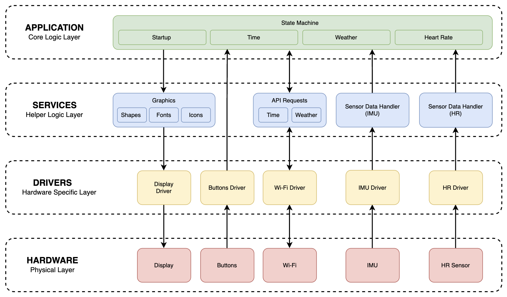

# ESP32 wearable firmware

An ESP32-C3-based wearable smartwatch designed to apply core embedded systems concepts. This project consolidates my knowledge of electronics fundamentals, microcontroller architecture, and embedded C into a fully functional, integrated system.

## Features

- Time
- Date
- Battery percentage
- Steps count
- Weather forecast
- Heart rate sensor

## Software Stack

- PlatformIO
- ESP-IDF
- C

## Hardware

| # | Image | Name / Model | Qty | Description |
| --- | --- | --- | --- | --- |
|  |  | ESP32-C3 PRO MINI | 1 | MCU based dev board |
|  |  | ST7789 LCD TFT  | 1 | 240x240 display |
|  |  | QMI8658A | 1 | 6-axis inertial measurement unit  |
|  |  | MAX30102 | 1 | heart rate sensor |
|  |  | GEB403035 | 1 | LiPo 400 mAh (3.7 V) power supply |
|  |  | S7V8F3 | 1 | buck-boost 3.3 V converter |
|  |  | TP4057 module* | 1 | charge controller |
|  |  | Push button | 2 | user input |
|  |  | Capacitor 0.1 uF | 1 | power supply filter |
|  |  | Capacitor 10 uF | 1 | power supply filter |
|  |  | Resistor 3.3 kOhm | 1 | to create voltage divider |
|  |  | Resistor 6.8 kOhm | 1 | to create voltage divider |

* *battery charge controller TP4057 is used in a module form for prototyping, but IC is used for PCB assembly. 
This is the list of parts to assemble a separate charge module based on TP4057 IC:*

| # | Name / Model | Qty |
| --- | --- | --- |
| 1 | Integrated circuit TP4057 | 1 |
| 2 | Resistor 330 Ohm | 1 |
| 3 | Resistor 2 kOhm | 1 |
| 4 | LED green | 1 |
| 5 | LED red | 1 |
| 6 | Capacitor 1 uF | 1 |
| 7 | Capacitor 10 uF | 1 |

## System Architecture

## Wiring

*diagram*

## Schematic

*diagram*

## PCB layout

*diagram*

## Case

*scheme*

## Build Instructions

*step by step guide*

## Memory Usage

*optional*

## Timing

*optional*

## Battery consumption

*table*

## Challenges

*problem -> cause -> solution*

## Future Improvements

- Settings screen (adjust brightness, region select for weather forecast etc.)
- Bluetooth support

## Screenshots / Photos

*logic analyzer and/or oscilloscope captures*,
*hardware photos*