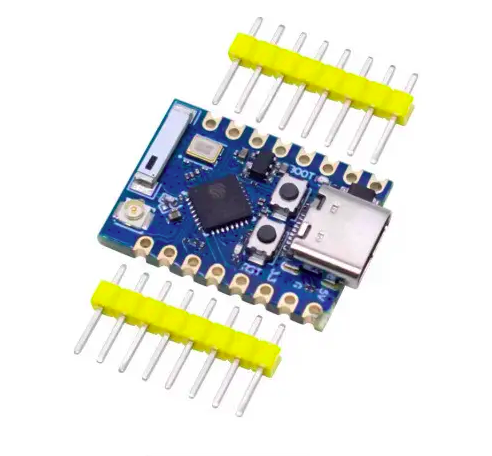
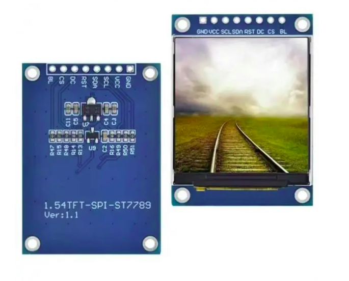
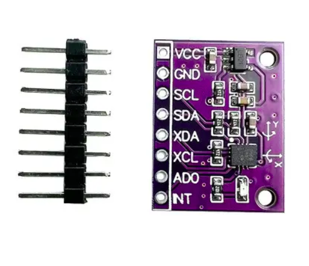
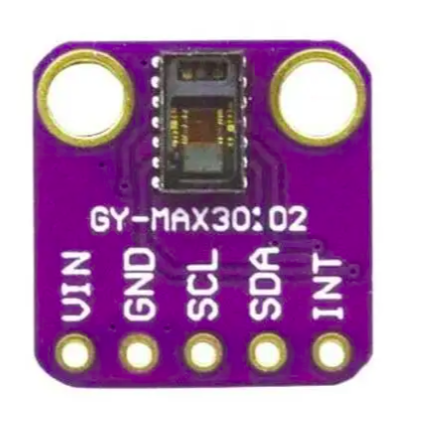
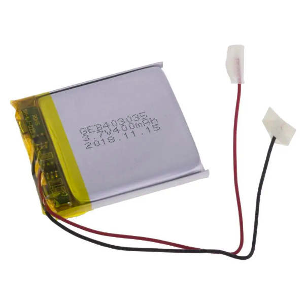
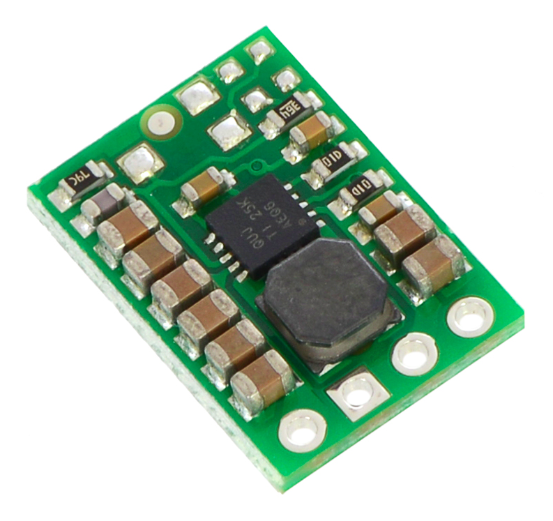
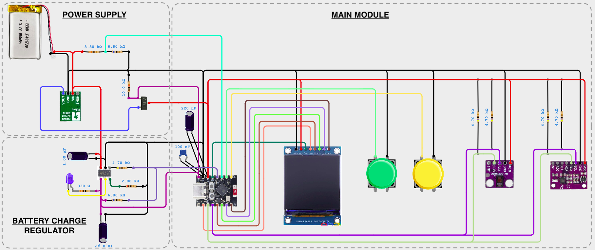
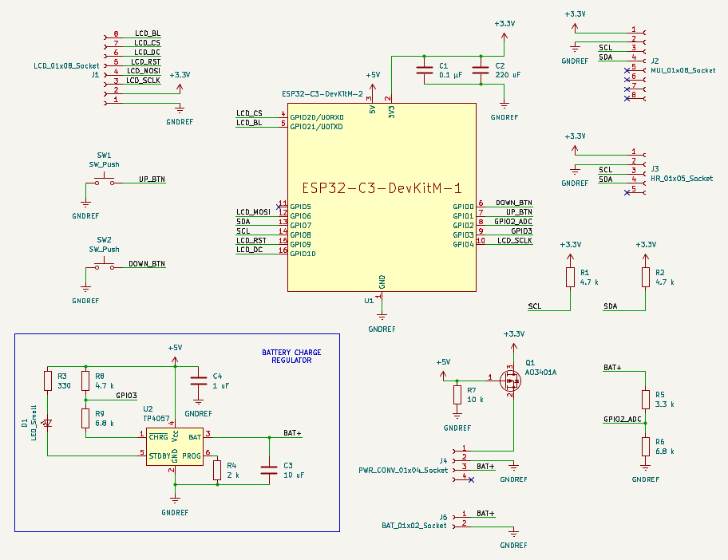

# ESP32 wearable firmware

An ESP32-C3-based wearable smartwatch designed to apply core embedded systems concepts. This project consolidates my knowledge of electronics fundamentals, microcontroller architecture, and embedded C into a fully functional, integrated system.

## Features

- Time
- Date
- Battery percentage
- Steps count
- Weather forecast
- Heart rate sensor

## Software Stack

- PlatformIO
- ESP-IDF
- C

## Hardware
### Main Module

| # | Image | Name / Model | Qty | Description |
| --- | --- | --- | --- | --- |
| 1 |  | ESP32-C3 PRO MINI | 1 | MCU based dev board |
| 2 |  | ST7789 LCD TFT  | 1 | 240x240 display |
| 3 |  | QMI8658A | 1 | 6-axis inertial measurement unit  |
| 4 |  | MAX30102 | 1 | heart rate sensor |
| 5 | --- | Push button | 2 | user input |
| 6 | --- | Capacitor 0.1 uF | 1 | power supply filter |
| 7 | --- | Capacitor 220 uF | 1 | power supply filter |
| 8 | --- | Resistor 4.7 kOhm | 4 | I2C lines pull-ups |

### Power Supply

| # | Image | Name / Model | Qty | Description |
| --- | --- | --- | --- | --- |
| 1 |  | GEB403035 | 1 | LiPo 400 mAh (3.7 V) power supply |
| 2 |  | S7V8F3 | 1 | buck-boost 3.3 V converter |
| 3 | --- | AO3401A | 1 | p-channel MOSFET |
| 4 | --- | Resistor 10 kOhm | 1 | gate pull-down resistor |
| 5 | --- | Resistor 3.3 kOhm | 1 | for voltage divider |
| 6 | --- | Resistor 6.8 kOhm | 1 | for voltage divider |

### Battery Charge Regulator

| # | Name / Model | Qty |
| --- | --- | --- |
| 1 | Integrated circuit TP4057 | 1 |
| 2 | Resistor 330 Ohm | 1 |
| 3 | Resistor 2 kOhm | 1 |
| 3 | Resistor 4.7 kOhm | 1 |
| 3 | Resistor 6.8 kOhm | 1 |
| 4 | LED blue | 1 |
| 6 | Capacitor 1 uF | 1 |
| 7 | Capacitor 10 uF | 1 |

## System Architecture

</img>

*Created using [draw.io](https://www.drawio.com/)*

## Wiring

</img>

*Created using [Cirkit Designer](https://app.cirkitdesigner.com/)*

## Schematic

</img>

*Created using [KiCad](https://www.kicad.org/)*

## PCB layout

*This section will be updated soon...*

## Case

*This section will be updated soon...*

## Build Instructions

*This section will be updated soon...*

## CPU Usage

*This section will be updated soon...*

## Memory Usage

*This section will be updated soon...*

## Timing

*This section will be updated soon...*

## Battery consumption

*This section will be updated soon...*

## Challenges

1. MCU constant reboot on Wi-Fi connection \
  **Cause**: MCU Wi-Fi module draws brief, sharp current spikes up to 500 mA and it causes a voltage drop below the minimum operating threshold \
  **Solution**: Capacitors decoupling pairing ceramic 100 nF for high frequencies switching noise and electrolytic 220 uF bulk reservoir

2. Reboot after 20-30 seconds of operation \
  **Cause**: Long wires introduce wire resistance and parasitic inductance that causes a voltage drop during normal operation triggering the brownout reset. \
  **Solution**: Shorter wires

## Future Improvements

- Settings screen (adjust brightness, region select for weather forecast etc.)
- Bluetooth support

## Screenshots / Photos

*This section is currently under construction and will be updated soon*
